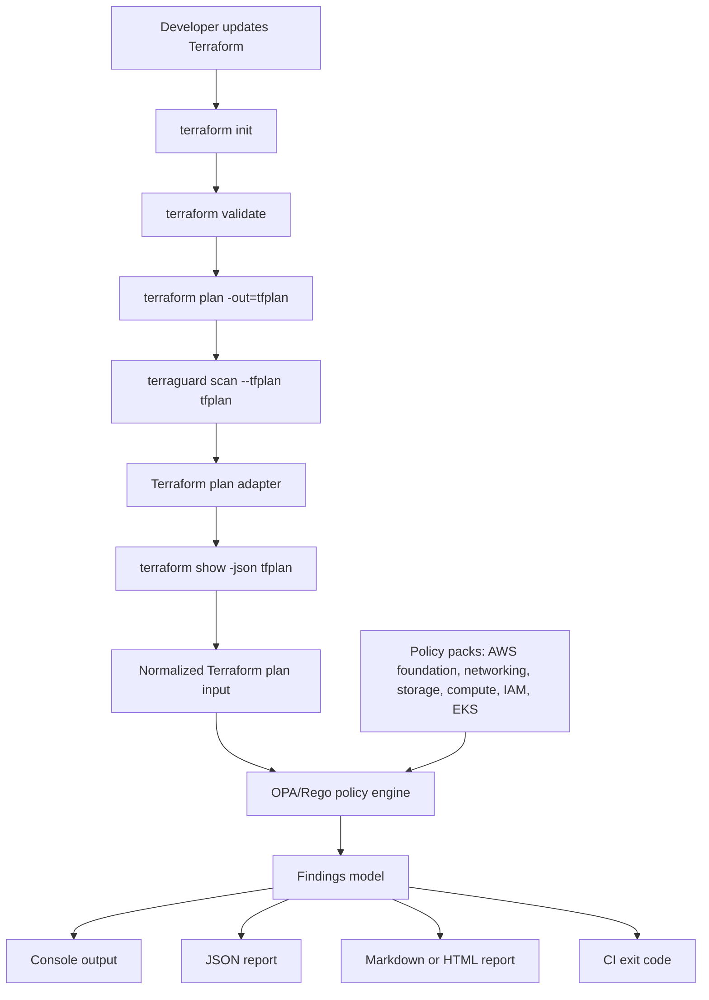
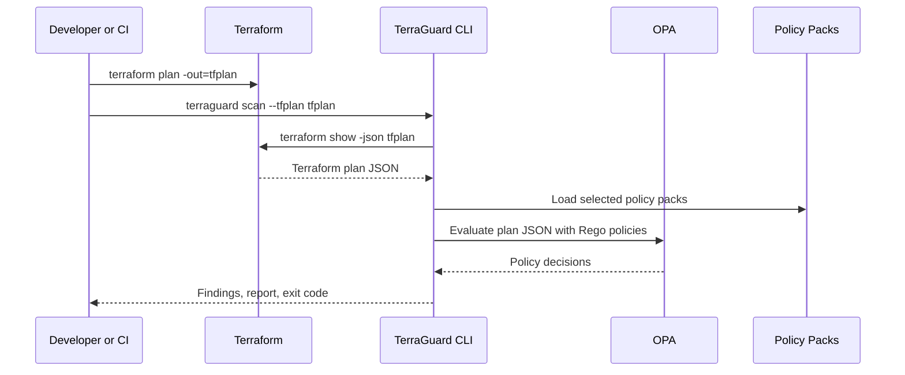

# Architecture

TerraGuard CLI validates Terraform plans against OPA/Rego policy packs before infrastructure is applied.

## High-Level Flow



## Main Components

- CLI layer: parses commands, flags, config paths, and output options.
- Config loader: reads `.terraguard.yml` and merges CLI overrides.
- Terraform adapter: accepts Terraform plan files and converts them to JSON.
- Policy loader: discovers built-in and custom policy packs.
- OPA runner: evaluates Terraform plan input against selected Rego policies.
- Findings model: normalizes violations into a consistent structure.
- Output renderers: format findings for terminal, JSON, Markdown, HTML, and SARIF.
- Doctor checks: verifies Terraform, OPA, config, and policy availability.

## Data Flow



## Policy Evaluation Model

Each policy should produce structured findings with:

- Policy ID
- Title
- Severity
- Resource type
- Resource address
- Message
- Remediation guidance
- References, when useful

Example policy ID format:

```text
TG_AWS_S3_001
TG_AWS_EKS_001
TG_AWS_SG_001
```

## Failure Behavior

CI failure should be controlled by severity threshold.

Example:

```bash
terraguard scan --tfplan tfplan --fail-on high
```

Expected behavior:

- `critical` or `high` findings return exit code `1`
- `medium`, `low`, and `info` findings are reported but do not block
- invalid config, missing dependencies, or malformed plans return a separate error exit code
