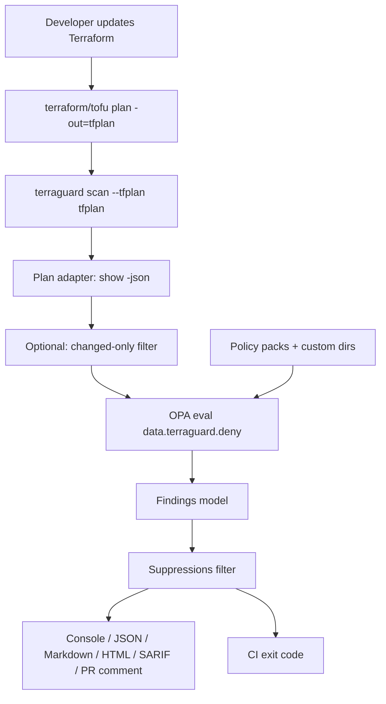

# Architecture

TerraGuard CLI validates Terraform or OpenTofu plans against OPA/Rego policy packs before infrastructure is applied.

## High-Level Flow



## Components

| Layer | Responsibility |
|-------|----------------|
| CLI (`terraguard/commands`) | Typer commands, flags, user-facing errors |
| Config | `.terraguard.yml` load + CLI overrides |
| Terraform adapter | `terraform`/`tofu show -json`, plan JSON load |
| Policy loader | Built-in + custom packs from `pack.yml` |
| OPA runner | `opa eval` / `opa fmt` / `opa test` |
| Scanner | Orchestrates plan → policies → findings |
| Suppressions | `.terraguard-ignore.yml` with expiry governance |
| Coverage | Plan resource types vs policies that cover them |
| Output | Console, JSON, Markdown, HTML, SARIF, sticky PR comments |

## Findings Contract

Scan JSON includes `schema_version` and matches `terraguard/schema/findings.schema.json`.

Each finding carries:

- Policy ID, title, severity
- Resource type and address
- Message and remediation
- Optional CIS/FSBP control IDs
- Optional suggested HCL fix snippet

## Failure Behavior

- Exit `0`: no failing findings
- Exit `1`: findings meet `--fail-on` threshold, or expired suppressions exist
- Exit `2`: config/dependency/plan/policy errors

```bash
terraguard scan --tfplan tfplan --fail-on high
```
